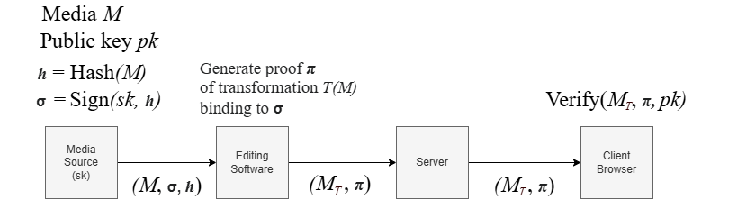

# HyperVerITAS Web

Browser demo for audio (and image) provenance: upload a file, apply a transformation, generate a proof with the HyperVerITAS or gnark prover, and **verify the proof in the browser** via a WASM build of the HyperVerITAS verifier.

## End-to-end demo



A trusted media source signs a hash of the original recording. Editing software applies a transformation and generates a proof π binding the edit to that signature; the server distributes the transformed media together with π, and any client can verify. As an example use case, the Chrome extension in [demo/](demo/) does this automatically — it injects verify badges on article pages and checks each image/audio element against the verifier API. See [demo/README.md](demo/README.md) to run it.

- `wasm/` — `hyperveritas_wasm` crate: the verifier compiled to WebAssembly (wasm-bindgen)
- `frontend/` — React/Vite app (verification runs in a web worker)
- `backend/` — Express/TypeScript API that shells out to the provers in this repo
- `prover/` — Docker container for the prover in production
- `infrastructure/` — AWS CDK stack
- `demo/` — Chrome extension demo (verifies badges on article pages)

## Setup

1. Build the WASM verifier (requires [wasm-pack](https://rustwasm.github.io/wasm-pack/)):

```bash
cd web/wasm
wasm-pack build --target web --out-dir ../frontend/src/wasm-pkg
```

2. Install and run (Node ≥ 18; uses npm workspaces):

```bash
cd web
npm install
npm run dev   # backend on :3006, frontend on Vite's default port
```

The backend locates the provers via relative paths inside this repo (override with the `HYPERVERITAS_PATH` env var). Proving requires the Rust/Go toolchains from the baseline components to be set up first.
